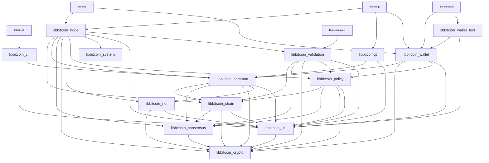

# Libraries

| Name                     | Description |
|--------------------------|-------------|
| *libbitcoin_chain*       | The model of a chain: per-network consensus parameters, proof of work, the block index and the UTXO view. No processing, no persistence. |
| *libbitcoin_cli*         | RPC client functionality used by *bitcoin-cli* executable |
| *libbitcoin_common*      | Home for common functionality shared by different executables and libraries. Similar to *libbitcoin_util*, but higher-level (see [Dependencies](#dependencies)). |
| *libbitcoin_consensus*   | Consensus rules: primitives, script interpreter, script templates and transaction checks. |
| *libbitcoin_crypto*      | Hardware-optimized functions for data encryption, hashing, message authentication, and key derivation. |
| *libbitcoinkernel*       | External consensus engine library with a C interface, built from the sources of the libraries in the `bitcoin_kernel` CMake target. |
| *libbitcoinqt*           | GUI functionality used by *bitcoin-qt* and *bitcoin-gui* executables. |
| *libbitcoin_ipc*         | IPC functionality used by *bitcoin-node* and *bitcoin-gui* executables to communicate when [`-DENABLE_IPC=ON`](multiprocess.md) is used. |
| *libbitcoin_net*         | Networking primitives: sockets and network address handling. |
| *libbitcoin_node*        | P2P and RPC server functionality used by *bitcoind* and *bitcoin-qt* executables. |
| *libbitcoin_policy*      | Transaction standardness rules that need no mempool state: fee rates, dust, virtual size, package shape. |
| *libbitcoin_system*      | Operating system services beyond the C++ standard library. |
| *libbitcoin_util*        | Generic helpers built on the C++ standard library. Similar to *libbitcoin_common*, but lower-level (see [Dependencies](#dependencies)). |
| *libbitcoin_validation*  | The validation engine: chainstate, block storage, transaction database, mempool, validation notifications. |
| *libbitcoin_wallet*      | Wallet functionality used by *bitcoind* and *bitcoin-wallet* executables. |
| *libbitcoin_wallet_tool* | Lower-level wallet functionality used by *bitcoin-wallet* executable. |
| *libbitcoin_zmq*         | [ZeroMQ](../zmq.md) functionality used by *bitcoind* and *bitcoin-qt* executables. |

## Conventions

- Most libraries are internal libraries and have APIs which are completely unstable! There are few or no restrictions on backwards compatibility or rules about external dependencies. An exception is *libbitcoinkernel*, which has a documented external interface in [`src/kernel/bitcoinkernel.h`](../../src/kernel/bitcoinkernel.h).

- A library is defined by what its code does, not by which executable uses it. When several consumers need only part of a library, that is a signal to split the library, not to move code toward a consumer.

- Generally each library should have a corresponding source directory and namespace. Source code organization is a work in progress, so it is true that some namespaces are applied inconsistently, and if you look at [`add_library(bitcoin_* ...)`](../../src/CMakeLists.txt) lists you can see that many libraries pull in files from outside their source directory. But when working with libraries, it is good to follow a consistent pattern like:

  - *libbitcoin_node* code lives in `src/node/` in the `node::` namespace
  - *libbitcoin_wallet* code lives in `src/wallet/` in the `wallet::` namespace
  - *libbitcoin_ipc* code lives in `src/ipc/` in the `ipc::` namespace
  - *libbitcoin_util* code lives in `src/util/` in the `util::` namespace
  - *libbitcoin_consensus* code lives in `src/consensus/` in the `Consensus::` namespace

## Dependencies

- Libraries should minimize what other libraries they depend on, and only reference symbols following the arrows shown in the dependency graph below:

<table><tr><td>

</td></tr><tr><td>

**Dependency graph**. Arrows show linker symbol dependencies. *Crypto* lib depends on nothing. *Util* lib is depended on by everything. *Validation* lib is used only by *libbitcoin_node* and by the external *libbitcoinkernel*, which is compiled from the sources of *validation* and everything below it.

</td></tr></table>

- The graph shows what _linker symbols_ (functions and variables) from each library other libraries can call and reference directly, but it is not a call graph. For example, there is no arrow connecting *libbitcoin_wallet* and *libbitcoin_node* libraries, because these libraries are intended to be modular and not depend on each other's internal implementation details. But wallet code is still able to call node code indirectly through the `interfaces::Chain` abstract class in [`interfaces/chain.h`](../../src/interfaces/chain.h) and node code calls wallet code through the `interfaces::ChainClient` and `interfaces::Chain::Notifications` abstract classes in the same file. In general, defining abstract classes in [`src/interfaces/`](../../src/interfaces/) can be a convenient way of avoiding unwanted direct dependencies or circular dependencies between libraries.

- *libbitcoin_crypto* should be a standalone dependency that any library can depend on, and it should not depend on any other libraries itself.

- *libbitcoin_consensus* should only depend on *libbitcoin_crypto*, and all other libraries besides *libbitcoin_crypto* should be allowed to depend on it.

- *libbitcoin_util* should be a standalone dependency that any library can depend on, and it should not depend on other libraries except *libbitcoin_crypto*. It provides basic utilities that fill in gaps in the C++ standard library. Since the util library is distributed with the kernel and is usable by kernel applications, it shouldn't contain functions that external code shouldn't call, like higher level code targeted at the node or wallet. (*libbitcoin_common* is a better place for higher level code, or code that is meant to be used by internal applications only.)

- *libbitcoin_net* should only depend on *libbitcoin_util* and *libbitcoin_crypto*, and *libbitcoin_system* should depend on nothing. Most operating system wrappers still live in *libbitcoin_util* and move to *libbitcoin_system* over time.

- *libbitcoin_chain* should only depend on *libbitcoin_consensus*, *libbitcoin_util*, and *libbitcoin_crypto*. The block index and the UTXO view are here rather than in *libbitcoin_validation* because proof of work takes a `CBlockIndex` and standardness checks take a `CCoinsViewCache`.

- *libbitcoin_policy* should only depend on *libbitcoin_chain*, *libbitcoin_consensus*, *libbitcoin_util*, and *libbitcoin_crypto*. Standardness rules that read the mempool stay in *libbitcoin_validation*.

- *libbitcoin_common* is a home for miscellaneous shared code used by different Bitcoin Core applications. It should not depend on anything other than *libbitcoin_chain*, *libbitcoin_util*, *libbitcoin_consensus*, and *libbitcoin_crypto*.

- *libbitcoin_validation* should only depend on *libbitcoin_policy*, *libbitcoin_chain*, *libbitcoin_util*, *libbitcoin_consensus*, and *libbitcoin_crypto*.

- The only thing that should depend on *libbitcoin_validation* internally should be *libbitcoin_node*. GUI and wallet libraries *libbitcoinqt* and *libbitcoin_wallet* in particular should not depend on *libbitcoin_validation* and the unneeded functionality it would pull in, like block validation. To the extent that GUI and wallet code need scripting, policy and signing functionality, they should get it from *libbitcoin_consensus*, *libbitcoin_policy*, *libbitcoin_common*, *libbitcoin_crypto*, and *libbitcoin_util*.

- The CMake interface target `bitcoin_kernel` names the libraries that make up the consensus engine. It compiles nothing. *libbitcoinkernel* is built from the sources of those libraries, so the internal and external builds cannot use different source lists.

- GUI, node, and wallet code internal implementations should all be independent of each other, and the *libbitcoinqt*, *libbitcoin_node*, *libbitcoin_wallet* libraries should never reference each other's symbols. They should only call each other through [`src/interfaces/`](../../src/interfaces/) abstract interfaces.

## Work in progress

- The mempool is moving out of *libbitcoin_validation* as part of [The libbitcoinkernel Project #27587](https://github.com/bitcoin/bitcoin/issues/27587).
